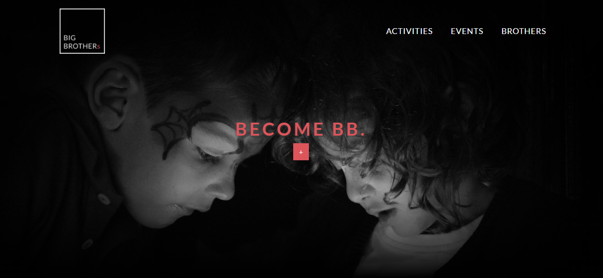
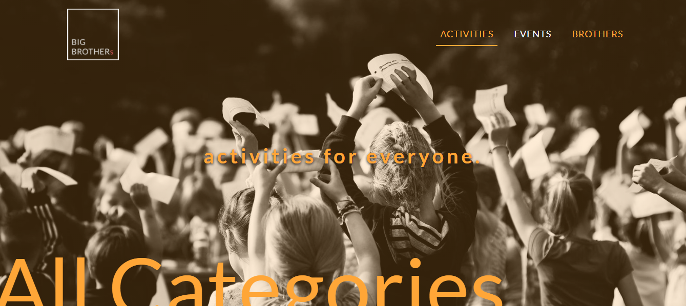
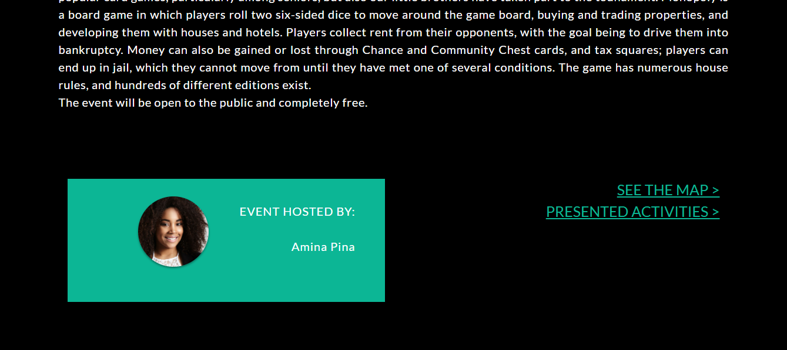

# Hypermedia Application Project 2020

This website have been developed as a final project for the course Hypermedia Application (Web and Multimedia) @ Politecnico di Milano, A.Y.2019-2020

The website can be reached at the following link:
[Big Brothers website](https://bigbrothershyp.herokuapp.com/).

## Screenshots
Here follow some examplary screenshots of the website:
- a screenshot of the Homepage:

- a screenshot of the "Activities" page with the mouse hovering on "Brothers":

- a screenshot of the bottom of an "Event" page:

## Documentation
The full documentation of the project (also containing more screenshots of the website) can be found in the [Documentation](./Documentation.pdf) file.
